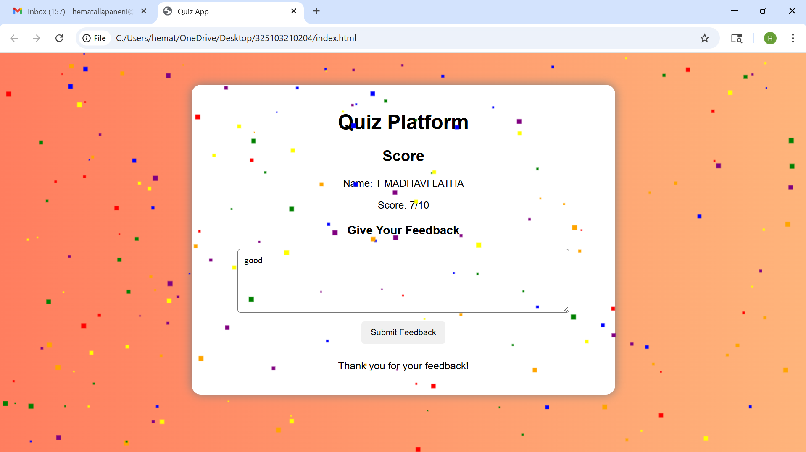

#Quiz Platform

A simple and interactive web-based quiz application built using HTML, CSS, and JavaScript.
This project allows users to answer questions, navigate between them, and view their score on a leaderboard.

---

🚀 Features

- ⏱️ Timer for each question
- ➡️ Next and ⬅️ Back navigation between questions
- 🧠 Multiple choice questions
- 📊 Leaderboard to display user scores
- 🎨 Attractive and user-friendly UI

---

🛠️ Technologies Used

- HTML
- CSS
- JavaScript

---

📸 Project Preview

---

▶️ How to Run

1. Download or clone the repository
2. Open the project folder
3. Double click on "index.html"
4. The quiz will open in your browser

---

📂 Project Structure

- "index.html" → Main page
- "style.css" → Styling
- "script.js" → Logic and functionality

---

🙋‍♀️ Author

- Hema Priya

---

💡 Future Improvements

- Add more questions dynamically
- Store leaderboard data permanently
- Add login/signup feature

---

⭐ If you like this project

Give it a star on GitHub ⭐
